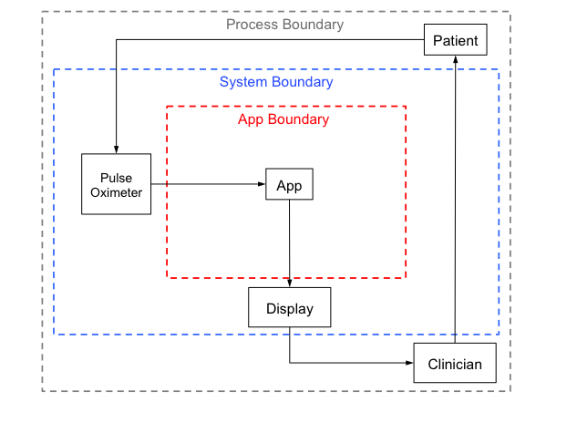
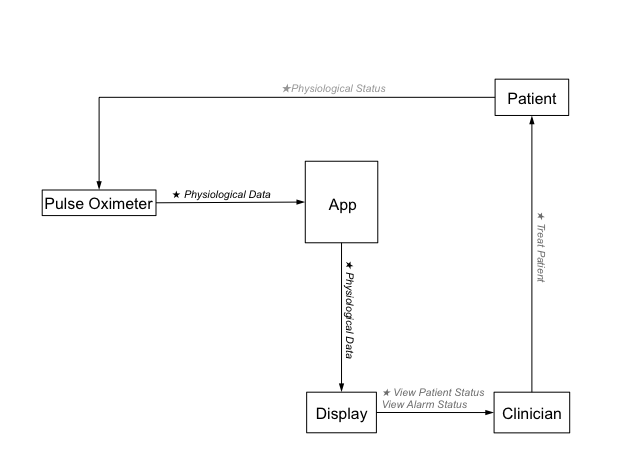

.. include:: ../../util/substitution.rst
.. default-domain:: aadl
.. _hazard-analysis-fundamentals:

###########################
Background and Fundamentals
###########################

Before a hazard analysis can begin, there are a number of app background elements and *fundamentals* that should be established. These fundamentals are documented as AADL property constants.

*********************
Background Properties
*********************

.. property:: context

   The clinical context of the app. That is, the problem that the app will address. There should only be one context per app.

   :type: AADLString
   :example: "Clinicians want to view physiological parameters on a display not physically connected to a physiological monitor."

.. property:: assumption

   An assumption about the environment / clinical process where the app will be used.

   :type: AADLString
   :example: "There are no device-based alarms that need forwarding."

.. note::
   The names of the context and assumption properties are ignored by the report generator.

.. property:: abbreviation

   An assumption about the environment / clinical process where the app will be used.

   :type: Record
   :subproperty Full: The full version of the abbreviated term
   :subproperty Definition: The meaning of the abbreviated term
   :type Full: AADLString
   :type Definition: AADLString
   :example: 
.. code-block:: aadl
   :linenos:
   
   property set ExampleAbbreviationSet is
	   SpO2 : constant MAP_Error_Properties::Abbreviation => [
		  Full => "Blood-oxygen saturation";
		  Definition => "The amount of oxygen in the patient's blood";
	   ];
   end ExampleAbbreviationSet;

****************************
Hazard Analysis Fundamentals
****************************

.. property:: accident_level

   The priority of an accident. Used for prioritization when mitigating one hazard would increase exposure to another.

   :type: Record
   :subproperty Level: The accident priority
   :subproperty Description: A short description of the accident level
   :type Level: AADLInteger
   :type Description: AADLString
   :example:
.. code-block:: aadl
   :linenos:
   
   property set ExampleAccident_LevelSet is
	   DeathOrInjury : constant MAP_Error_Properties::Accident_Level => [
		   Level => 1;
		   Description => "A human is killed or seriously injured.";
	   ];
   end ExampleAccident_LevelSet;
   
.. property:: accident

   A particular accident that could occur as a result of the app.

   :type: Record
   :subproperty Number: An identifier
   :subproperty Description: A short description of the accident
   :subproperty Level: The accident level associated with this accident
   :type Number: AADLInteger
   :type Description: AADLString
   :type Level: :property:`MAP_Error_Properties::Accident_Level<Accident_Level>`
   :example:
.. code-block:: aadl
   :linenos:
   
   property set ExampleAccidentSet is
	   PatientHarmed : constant MAP_Error_Properties::Accident => [
		   Number => 1;
		   Description => "Patient is killed or seriously injured.";
		   Level => PulseOx_Forwarding_Error_Properties::DeathOrInjury;
	   ];
   end ExampleAccidentSet;
   
.. property:: hazard

   A particular hazard that the app could encounter.

   :type: Record
   :subproperty Number: An identifier
   :subproperty Description: A short description of the hazard
   :subproperty Accident: The accident that would occur if this hazard comes to pass
   :type Number: AADLInteger
   :type Description: AADLString
   :type Accident: :property:`MAP_Error_Properties::Accident<Accident>`
   :example:
.. code-block:: aadl
   :linenos:
   
   property set ExampleHazardSet is
	   BadInfoDisplayed : constant MAP_Error_Properties::Hazard => [
		   Number => 1;
		   Description => "Incorrect information is sent to the display.";
		   Accident => PulseOx_Forwarding_Error_Properties::PatientHarmed;
	   ];
   end ExampleHazardSet;

.. property:: constraint

   A safety constraint that, if enforced, will prevent a particular hazard from occurring.

   :type: Record
   :subproperty Number: An identifier
   :subproperty Description: A short description of the constraint
   :subproperty Hazard: The hazard that would be present if this constraint is not enforced
   :type Number: AADLInteger
   :type Description: AADLString
   :type Hazard: :property:`MAP_Error_Properties::Hazard<Hazard>`
   :example:
.. code-block:: aadl
   :linenos:
   
   property set ExampleConstraintSet is
	   ShowGoodInfo : constant MAP_Error_Properties::Constraint => [
		   Number => 1;
		   Description => "The app must accurately inform the display of the status of the patient's vital signs.";
		   Hazard => PulseOx_Forwarding_Error_Properties::BadInfoDisplayed;
	   ];
   end ExampleConstraintSet;

***************
System Diagrams
***************

Two of the "fundamentals" identified in |STPA| are graphical in nature -- an identification of the system's boundaries and an allocation of control actions individual channels of communication between components.  Unfortunately, these diagrams cannot be automatically created. To add them to the report, save the diagrams as SystemBoundary.png and ProcessModel.png in a folder named diagrams at the top level of your project.

System Boundaries
=================

We believe (see the |MEMOCODE14 publication|) that there are two additional boundaries in addition to what Leveson refers to as the system boundary. The three boundaries in a MAP app are:

* The process boundary: All elements involved in the clinical workflow / process that the app is designed to support.
* The system boundary: All components that correspond with the app -- so, devices and displays, but not people (the clinician interacts with the app through a display, the patient through a device).
* The app boundary: All components that the app controls / is controlled by -- so, the communication links between devices and the app, but not the devices themselves.

Here is an example specification of the boundaries for our example app (SystemBoundary.png):

Process Model
=============

One of the benefits of modeling an app in our subset of AADL is the automatic identification of all messages that affect the state the system (ie, *feedback messages*, which measure the state of the system, and *control actions*, which modify it through actuation).  Leveson recommends that you identify these messages (which our report translator does automatically) and, later, allocate them to links between individual components in your *process model*.  The report generator will use an image of the process model -- this can be a screenshot of the system in AADL's graphical view, or a mockup.  Here's a mocked-up version of our example app's process model:

*******
Example
*******

.. literalinclude:: snippets/fundamentals.aadl
	:language: aadl
	:linenos:
	
***********
Translation
***********

The background and fundamental properties are pulled into / formatted as part of the report generation.  Additionally, control actions and feedback messages are identified and documented, and the process model and system boundary images are inserted into the report.  You can :download:`view a full report<PulseOx_Forwarding_System.html>`, or here are the parts of the report generated by the constructs on this page:

Background
==========

Context
-------

Clinicians want to view physiological parameters on a display not physically connected to a physiological monitor.

Assumptions
-----------

* There are no alarms that need forwarding.

Abbreviations
-------------

KVO
	Keep Vein Open: A minimal rate (of drug administration)

Fundamentals
============

System Boundaries
-----------------

   
Accident Levels
---------------

1. **DeathOrInjury**: A human is killed or seriously injured.

Accidents
---------

1. **PatientHarmed**: Patient is killed or seriously injured. [DeathOrInjury]

Hazards
-------

1. **BadInfoDisplayed**: Incorrect information is sent to the display. [PatientHarmed]
2. **MissedAlarm**: An alarm that should be displayed is not. [PatientHarmed]

Safety Constraints
------------------

1. **ShowGoodInfo**: The app must accurately inform the display of the status of the patient's vital signs. [BadInfoDisplayed]
2. **ShowAllAlarms**: The app must display all alarms that are clinically necessary. [MissedAlarm]

Control Actions
---------------

1. spo2_to_display: ICEpoInterface -> PulseOx_Display_Process (Integer)
2. alarm_to_display: PulseOx_Logic_Process -> PulseOx_Display_Process (Event)

Process Model
-------------

