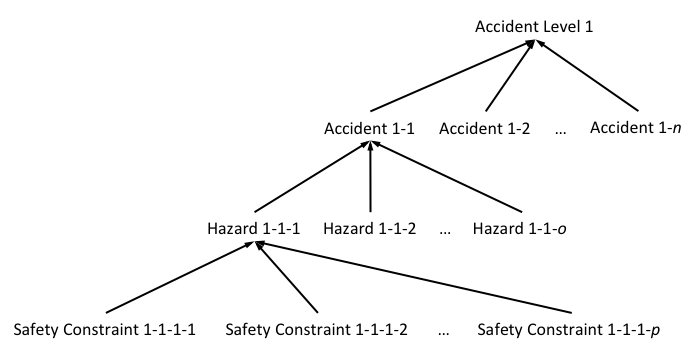

.. include:: ../util/substitution.rst
.. default-domain:: aadl
.. _hazard-analysis-fundamentals:

#########################
System-Level Fundamentals
#########################

Before a hazard analysis can begin, there are a number of system-level *fundamental properties* that should be established. These fundamentals are documented as a large AADL property that is applied to the system element (typically an :construct:`abstract` component) that would be negatively impacted. A full discussion of the theory behind these fundamentals is out of scope for this documentation; users should be familiar with concepts and terminology from |Systematic Analysis of Faults and Errors|. 

.. note:: The properties on this page correspond to |SAFE|'s Activity 0.

The top-level fundamental property is an :property:`accidentlevel`, which is the level of loss (ie, death or serious injury) that might occur if something goes wrong. There can be multiple accident levels, and each can have multiple :property:`accident` subproperties. These describe specific notions of loss (ie, patient dies) associated with a particular accident level. Each accident should have one or more :property:`hazard` subproperties, which describe situations where the accident occurs (ie, patient is given improper treatment by the clinician). Each hazard then has one or more safety :property:`constraint` subproperties. If these constraints are enforced, then the hazard (and its associated notion of loss) will be avoided.

These properties can be thought of as forming a collection of trees, where accident levels form the roots of the tree. One possible tree is shown below.

****************************
Hazard Analysis Fundamentals
****************************

.. property:: accidentlevel

   The priority of an accident. Used for prioritization when mitigating one hazard would increase exposure to another.

   :type: Record
   :subproperty Name: The name of this accident level
   :subproperty Description: A short description of the accident level
   :subproperty Explanations: |Explanations|
   :subproperty Accidents: A list of ways losses of this level could occur.
   :type Name: AADLString
   :type Explanations: List of AADLString
   :type Accidents: List of :property:`accident`
   :example:
.. literalinclude:: snippets/fundamentals.aadl
   :language: aadl
   :lines: 38-43
   :dedent: 2
   :linenos:
   
.. property:: accident

   A particular accident (or loss) that could occur as a result of the app-composed system. Accidents are subproperties of the accident level they would cause.

   :type: Record
   :subproperty Name: The name of this accident
   :subproperty Description: A short description of the accident
   :subproperty Explanations: |Explanations|
   :subproperty Hazards: A list of ways this accident could occur.
   :type Name: AADLString
   :type Description: AADLString
   :type Explanations: List of AADLString
   :type Accidents: List of :property:`hazard`
   :example:
.. literalinclude:: snippets/fundamentals.aadl
   :language: aadl
   :lines: 44-49
   :dedent: 4
   :linenos:
   
.. property:: hazard

   A hazard that the app could encounter. In |STPA| and |SAFE|, hazards are defined as a system state and its worst-case environmental state pairing. We also borrow the concept of a "hazardous element" from the |Ericson book| (which we rename to hazardous factor).
   
   :type: Record
   :subproperty Name: The name of this hazard
   :subproperty Description: A short description of the accident
   :subproperty HazardousFactor: The "basic hazardous resource creating the impetus for the hazard" (|Ericson book|)
   :subproperty SystemElement: The component in the system which is the direct cause of the hazard.
   :subproperty EnvironmentElement: The component in the environment where the loss associated with this hazard will occur.
   :subproperty Explanations: |Explanations|
   :subproperty Constraints: A list of ways to prevent this hazard.
   :type Name: AADLString
   :type Description: AADLString
   :type HazardousFactor: AADLString
   :type SystemElement: :construct:`device` or :construct:`process` reference
   :type EnvironmentElement: :construct:`abstract` reference
   :type Explanations: List of AADLString
   :type Constraints: List of :property:`constraint`
   :example:
.. literalinclude:: snippets/fundamentals.aadl
   :language: aadl
   :lines: 50-57
   :dedent: 5
   :linenos:

.. property:: constraint

   A safety constraint that, if enforced, will prevent its associated hazard from occurring.

   :type: Record
   :subproperty Name: The name of this safety constraint
   :subproperty Description: A short description of the safety constraint
   :subproperty ErrorType: The specific error type that signifies the violation of this constraint
   :subproperty Explanations: |Explanations|
   :type Name: AADLString
   :type Description: AADLString
   :type ErrorType: :construct:`errortype`
   :type Explanations: List of AADLString
   :example:
.. literalinclude:: snippets/fundamentals.aadl
   :language: aadl
   :lines: 58-63
   :dedent: 6
   :linenos:
   
.. property:: explanations

   Certain parts of the fundamentals structure or the system itself require more explanation. The optional explanations subproperty can be used to add as many string-based explanations as necessary to either the system itself (as a top-level subproperty of the fundamentals property) or to one of the other definitions (:property:`accidentlevel`, :property:`accident`, :property:`hazard`, or :property:`constraint`).

   :type: List of AADLString
   :example:
.. literalinclude:: snippets/fundamentals.aadl
   :language: aadl
   :lines: 38-81
   :emphasize-lines: 5, 11, 26, 38, 43
   :dedent: 2
   :linenos:

*******
Example
*******

.. literalinclude:: snippets/fundamentals.aadl
	:language: aadl
	:linenos:
	
***********
Translation
***********

The fundamental properties are pulled in and formatted as part of report generation, and component / connection names and types are identified and documented.  You can :download:`view a full report<PulseOx_Forwarding_System.html>`, or here are the parts of the report generated by the constructs on this page:

T-SAFE: Overview for POForwarding-Tests
=======================================

*This report was generated by the* `MDCF
Architect <http://santoslab.org/pub/mdcf-architect>`__ *on June 6, 2016
at 3:03 PM*

Table of Contents
-----------------

1. `Fundamentals <#fundamentals>`__

   1. `Accident Levels <#accident-levels>`__
   2. `Accidents <#accidents>`__
   3. `Hazards <#hazards>`__
   4. `Safety Constraints <#safety-constraints>`__

2. `Decomposition <#decomposition>`__

   1. `Components <#components>`__
   2. `Connections <#connections>`__

3. `Explanations <#explanations>`__

Fundamentals
------------

Accident Levels
~~~~~~~~~~~~~~~

1. **DeathOrInjury**: A human is killed or seriously injured.

   -  First Explanation
   -  Second Explanation
   -  Third Explanation

Accidents
~~~~~~~~~

1. **PatientHarmed**: Patient is killed or seriously injured.
   [DeathOrInjury]

   -  First Explanation
   -  Second Explanation
   -  Third Explanation

Hazards
~~~~~~~

1. **BadInfoDisplayed**: Incorrect information is sent to the display.
   [PatientHarmed]
2. **InfoLate**: Information that is out of date is sent to the display.
   [PatientHarmed]

Safety Constraints
~~~~~~~~~~~~~~~~~~

1. **ShowInfoOnTime**: The app must inform the display of the status of
   the patient's vital signs in a timely manner. [InfoLate]

   -  First Explanation
   -  Second Explanation
   -  Third Explanation

2. **ShowGoodInfo**: The app must accurately inform the display of the
   status of the patient's vital signs. [BadInfoDisplayed]

   -  First Explanation
   -  Second Explanation
   -  Third Explanation

Decomposition
-------------

Components
~~~~~~~~~~

#. `appLogic <applogic.html>`__: PulseOx\_Logic\_Process
#. `appDisplay <appdisplay.html>`__: PulseOx\_Display\_Process
#. `pulseOx <pulseox.html>`__: ICEpoInterface

Connections
~~~~~~~~~~~

#. spo2\_to\_logic: pulseOx.SpO2 -> appLogic.SpO2 [Double]
#. logic\_to\_spo2: appLogic.SpO2 -> pulseOx.SpO2 [Double]
#. spo2\_to\_display: pulseOx.SpO2 -> appDisplay.SpO2 [Double]
#. alarm\_to\_display: appLogic.DerivedAlarm -> appDisplay.DerivedAlarm [Object]

Explanations
------------

-  First Explanation
-  Second Explanation
-  Third Explanation

