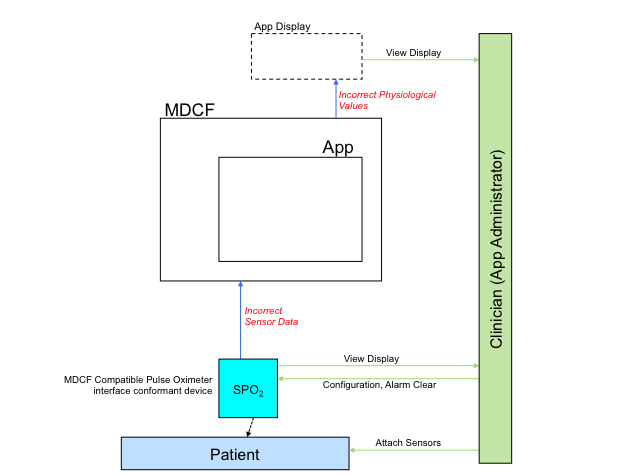

.. include:: ../util/substitution.rst
.. _hazard-analysis-overview:

########################
Hazard Analysis Overview
########################

Once your application has been modeled in the :ref:`supported subset of AADL<aadl-subset-overview>`, you can annotate it to include hazard analysis information.  This information will then be used our translator to produce a hazard analysis report. This work was first discussed in this |MEMOCODE14 publication|.

These annotations include both custom properties and a subset of AADL's error-modeling (EMV2) annex, and the report format is derivative of / inspired by `System Theoretic Process Analysis <http://ocw.mit.edu/courses/aeronautics-and-astronautics/16-63j-system-safety-fall-2012/lecture-notes/MIT16_63JF12_Class10STPA.pdf>`_ (STPA).

***********
Example App
***********

In this language walkthrough, we'll be re-using the app developed in the :ref:`aadl-subset-overview`. The above app diagram has been annotated with two errors (in red). You can :download:`view the generated report<PulseOx_Forwarding_System.html>`.

.. You can also download :download:`annotated AADL<snippets/pulse-ox-forwarding.zip>`, or :download:`view the generated report<PulseOx_Forwarding_System.html>`.

	occurrence
	components

.. toctree::
	:hidden:
	
	fundamentals