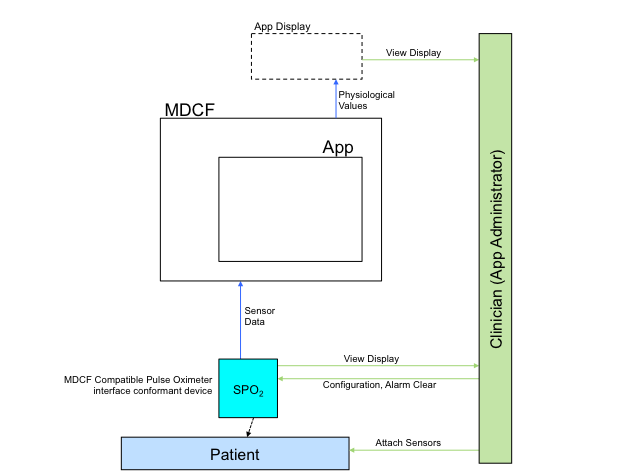

.. include:: ../util/substitution.rst
.. default-domain:: aadl
.. _aadl-subset-overview:

####################
AADL Subset Overview
####################

The |MDCF Architect| operates on a restricted subset of AADL's full syntax, with slightly modified semantics.  The syntax and semantics changes are necessary primarily because AADL was designed to target systems composed of known hardware and software, while MAP apps run on managed platforms.  A less developer-targeted overview of the MDCF Architect (as well as the vision and background that contextualize the effort) can be found in this |SEHC14 publication|.

***************
AADL Constructs
***************

At a high level, MAP apps are defined by :construct:`systems<system>`, which contain :construct:`device` and :construct:`process` components.  Process components are further decomposed into :construct:`threads<thread>`.  The various components communicate over :construct:`ports<port>` via :construct:`port connections<portconnection>`.

***************
AADL Properties
***************

AADL properties, which are used to configure real-time and quality-of-service parameters, can either be set as defaults for an entire app, or used as single-component overrides.  

**********
Data Types
**********

AADL supports data type modeling, and the MDCF architect uses these data types for its analysis and code-generation tasks. Data types are currently specified only by their representation: Boolean, Float or Integer.

***********
Example App
***********

In this language walkthrough, we'll use the a very simple "Pulse Oximetry Display" app as a running example. A high-level, information-flow centric view of this app is shown above.  This app's job is to take information from a pulse oximeter device and display it on the MAP display. It does not have many advanced features (eg, alarms, device control, complex logic, etc.) but it allows us to illustrate the various features of the MDCF architect.
   
.. toctree::
	:hidden:
	
	system
	device
	process
	port
	property